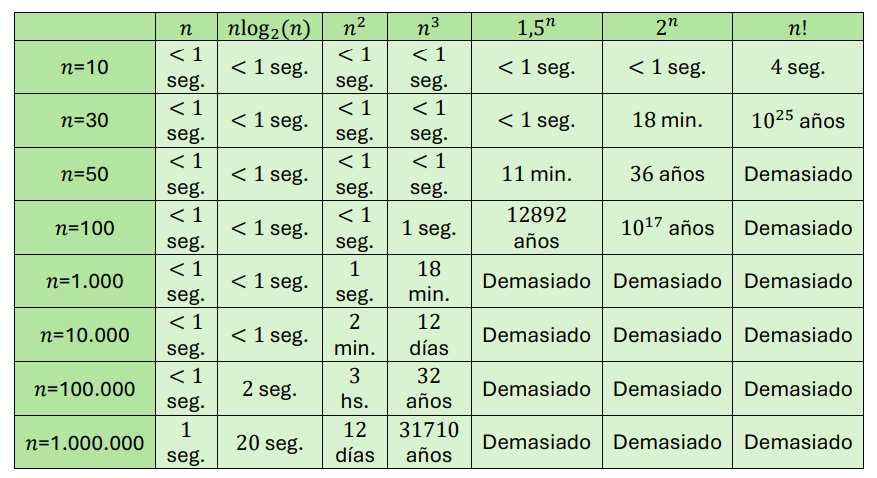

# Clase 03 - Análisis de algoritmos

**Fecha:** 18-12-2025
**Estado:** 🟢 Completado

## Resumen en 3 líneas

Eficiencia medida en base a existencia de algoritmos de tiempo polinómico. Crecimiento asintótico con las notaciones $O,\Omega,\Theta$ y propiedades de estas nociones para medir tiempos de ejecución.
Propiedades sobre las funciones más comunes: polinomios, logarítmos y exponenciales

## Preguntas Clave

1. ¿Cuál es la diferencia entre la notación $O$ y $\Omega$?
2. ¿Cuáles son las ventajas y desventajas de definir la eficiencia de un algoritmo en base a si es de tiempo polinomial o no?
3. ¿Qué queremos decir cuando decimos que un algorítmo tiene tiempo exponencial?

## Contenido

### Introducción al análisis de algoritmos

El análisis de algoritmos implica considerar como escalan los requisitos de recursos de ellos, es decir el tiempo que demoran en ejecutarse, y el espacio que precisan para almacenar información, a medida que crece la cantidad de datos con las que opera.

### Trazabilidad computacional

Uno de los primeros conceptos que aparecen y son fundamentales para la comprensión de este tema, es el concepto de eficiencia, para la cual podemos intentar dar una primera definición cómo:

_"Un algoritmo es eficiente si, cuando es implementado, se ejecuta rápidamente en instancias de entrada reales."_

Esta primera definición, omite algunas ideas que son fundamentales para definir la eficiencia:

- El donde se ejecuta el algoritmo, esto es muy importante ya que algoritmos no tan bien implementados en procesadores extremadamente rápidos, pueden ejecutarse rápidamente.
- Por otro lado, ¿qué es una instancia de entradas reales? Esto es muy dependiente del problema que estamos intentando resolver y las necesidades de quién precisa la solución.
- Además, la definición no tiene en cuenta lo que pasa con el algoritmo cuando el tamaño de la entrada crece de forma inesperada, que es un factor que queremos considerar para determinar la eficiencia.

Veamos algunos conceptos intermedios que serán importantes para acercarnos a una buena definición de eficiencia.

#### Tiempos de ejecución de peores casos y búsqueda por fuerza bruta

Lo primero que solemos aprender sobre tiempos de ejecución, es el análisis del peor tiempo de ejecución; esto se hace buscando un límite en el mayor tiempo de ejecución posible que el algoritmo pudiese tener sobre todas las entradas de un tamaño $N$ dado, y ver como esto crece con $N$. Esto es lo que ya hicimos anteriormente en Programación II (a nivel muy básico).
En general, se ha encontrado que el análisis del peor caso de un algorítmo hace un buen trabajo en capturar su eficiencia en la práctica.

Por otra parte, cuando obtenemos un tiempo de ejecución, naturalmente nos surge preguntarnos: ¿que punto de referencia analítico nos puede decir si un tiempo de ejecución es muy bueno o muy malo? Una primera guía bastante simple es comparando con el tiempo de búsqueda por fuerza bruta en el espacio de soluciones posibles.
Volvamos al problema de emparejamiento estable para agarrar intuición. Incluso cuando el tamaño de una instancia de entrada de emparejamiento estable es relativamente pequeño, el espacio de búsqueda que define es enorme, ya que hay $n!$ posibles combinaciones de parejas y nosotros necesitamos encontrar ahí un emparejamiento estable.
El algoritmo de fuerza bruta para este caso implicaría comprobar cada emparejamiento y verificar si es estable. En vez de quedarnos con esta solución, nosotros definimos un algoritmo que necesita dedicar un tiempo proporcional a $N$ para encontrar un emparejamiento estable en un campo tan grande de posibilidades. El enfoque analítico y matemático nos permitió llegar a esta conclusión sin necesidad de implementar ni ejecutar el algoritmo definido.

Esto será muy común en la mayoría de los problemas que estudiaremos: una representación compacta, especificando un espacio de búsqueda gigante. Para la mayoría de estos casos habrá una solución obvia de fuerza bruta.
Veremos como este enfoque no solo es demasiado lento para ser útil, sino también que no proporciona absolutamente ninguna idea de la estructura del problema que estamos estudiando.

Con todo esto, consideremos la siguiente nueva definición de eficiencia:

_"Un algoritmo es eficiente si se logra cualitativamente un mejor rendimiento del peor caso, en un nivel analítico, que la búsqueda por fuerza bruta."_

Pero, ¿qué queremos decir con un **rendimiento cualitativamente mejor**?

#### Tiempo polinomial como definición de eficiencia

Supongamos que un algoritmo cumple con la siguiente propiedad: existen constantes absolutas $c>0$ y $d>0$ tal que, para cada entrada de tamaño $N$, su tiempo de ejecución está acotado por $cN^d$ pasos computacionales primitivos. En otras palabras, su tiempo de ejecución es, como máximo proporcional a $N^d$.
Luego, decimos que si esta cota de tiempo de ejecución se cumple para algún $c$ y $d$, decimos que el algoritmo tiene un tiempo de ejecución polinómico.

Por esto, consideramos nuestra tercer definición de eficiencia:

_"Un algoritmo es eficiente si tiene un tiempo de ejecución polinómico."_

Mientras las anteriores descripciones parecían demasiado vagas, ésta parece demasiado descriptiva. Por ejemplo, si un algoritmo tiene un tiempo de ejecución proporcional a $n^{100}$, ¿no sería extremadamente ineficiente? La respuesta es que si, sería extremadamente ineficiente.
Pero, por mucho que se intente motivar abstractamente la definición de eficiencia en términos de tiempo polinómico, la realidad es más simple: realmente funciona.

Los problemas para los cuales existen algoritmos de tiempo polinómico casi invariablemente resultan tener algoritmos con tiempos de ejecución proporcionales a polinomios que crecen de manera moderada, como $n,n\log(n)n^2,n^3$. Asimismo, problemas para los cuales no se conoce un algoritmo de tiempo polinómico tienden a ser muy difíciles en la práctica.

Una razón más por la cual el formalismo matemático y la evidencia empírica parecen alinearse bien en el caso de la solvencia de tiempo polinomial es que la diferencia entre las tasas de crecimiento de funciones polinomiales y exponenciales es enorme. Consideremos la siguiente tabla que muestra los tiempos de ejecución para diferentes límites con diferentes tamaños de entradas; con un procesador que ejecuta un millón de instrucciones de alto nivel por segundo.

Otro beneficio fundamental para esta definición de eficiencia tan específica, es que se vuelve **negable**; es decir, permite expresar la no existencia de un algoritmo eficiente para un problema particular.

### Órden de crecimiento asintótico

Como ya se discutió anteriormente, por lo general estaremos contando pasos en una implementación de pseudocódigo de un algoritmo que se asemeja a un lenguaje de programación de alto nivel.

#### $O,\Omega$ y $\Theta$

Queremos poder expresar la tasa de crecimiento de los tiempos de ejecución y otras funciones, de una manera que sea insensible a factores constantes y términos de menor orden, es decir, nos gustaría tomar un tiempo de ejecución cómo $1.62n^2+3.5n+8$ y decir que crece cómo $n^2$. A continuación veremos una forma precisa de hacer esto.

##### Cotas superiores asintóticas

Sea $T(n)$ una función que representa el tiempo de ejecución en el peor de los casos de un algoritmo, con una entrada de tamaño $n$. Dada otra función $f(n)$, decimos que $T(n)$ es del orden $f(n)$, o de forma equivalente, $T(n)$ es $O(f(n))$ si para un $n$ suficientemente grande, la función $T(n)$ está acotada superiormente por una constante que es múltiplo de $f(n)$.
Refinando un poco la definición, podemos decir que $T(n)$ es $O(f(n))$ sii:

- Existen las constantes $c>0$ y $n_0\geq0$ tal que para todo $n\geq n_0$ se cumple que $T(n)\leq c\cdot f(n)$

Si esto se cumple, decimos que $T$ está acotada superiormente de forma asintótica por $f$. Es importante notar que esta definición requiere que exista una constante $c$ que funcione para todo $n$; en particular, $c$ no puede depender de $n$.

Veamos un ejemplo de cómo esta definición nos permite expresar cotas superiores para los tiempos de ejecución:
Consideremos un algoritmo que tiene un tiempo de ejecución de la forma $T(n)=an^2+bn+c$ con $a,b,c>0$. Nos gustaría afirmar que cualquier función de este tipo es $O(n^2)$.
Para entender porque, notamos que para todo $n>1$, se cumple que $qn\leq qn^2$ y $r\leq rn^2$. Entonces:

- $T(n)=pn^2+qn+r\leq pn^2+qn^2+rn^2\leq(p+q+r)n^2$ para todo $n\geq 1$

Por lo que encontramos $c=p+q+r$ tal que $T$ cumple con la definición de $O(-)$:

- $T(n)\leq cn^2$ para todo $n\geq n_0=1$

##### Cotas inferiores asintóticas

Existe una notación complementaria para las cotas inferiores. A menudo, cuando analizamos un algoritmo queremos mostrar que la cota superior que hallamos es "la mejor posible". Para esto introducimos el concepto complementario de las cotas inferiores asintóticas.
Lo que queremos hacer es expresar que para tamaños de entrada arbitrariamente grandes $n$, la función $T(n)$ es por lo menos una constante múltiplo de alguna función específica $f(n)$.
Con esto decimos que $T(n)$ es $\Omega(f(n))$ si existen constantes $\epsilon>0$ y $n_0\geq0$ tal que, para todo $n\geq n_0$ se cumple que $T(n)\geq\epsilon\cdot f(n)$

Esta definición funciona de forma similar a $O(-)$, excepto que estamos acotando la función $T(n)$ desde abajo.

##### Cotas asintóticamente ajustadas

Si podemos demostrar que un tiempo de ejecución $T(n)$ es tanto $O(f(n))$ como $\Omega(f(n))$, entonces en un sentido natural, hemos obtenido la cota "correcta": $T(n)$ crece exactamente como $f(n)$ dentro de un factor constante.

Cuando esto sucede, lo denotamos diciendo que $T(n)$ es $\Theta(f(n))$, donde decimos que $f(n)$ es una cota asintóticamente ajustada para $T(n)$.

Podemos obtener una cota asintóticamente ajustada directamente calculando un límite cuando $n$ tiende a infinito. Esencialmente si la razón entre las funciones $f(n)$ y $g(n)$ converge a una constante positiva cuando $n$ tiende a infinito, entonces $f(n)$ es $\Theta(g(n))$.

- **(2.1) Sean dos funciones $f$ y $g$ tales que: $\lim_{n\to\infty}\frac{f(n)}{g(n)}$ existe y es un número $c>0$. Entonces $f(n)=\Theta(g(n))$**

**Demostración** 

Usaremos el hecho de que el límite existe y es positivo para demostrar que $f(n)=O(g(n))$ y $f(n)=\Omega(g(n))$.

Como $\lim_{n\to\infty}\frac{f(n)}{g(n)}=c>0$, se deduce de la definición de límite que a partir de un cierto $n_0$ se cumple que: $\frac{c}{2}<\frac{f(n)}{g(n)}<2c$. De esto obtenemos que:

- $f(n)<2c\cdot g(n)\implies f(n)=O(g(n))$
- $f(n)>\frac{c}{2}\cdot g(n)\implies f(n)=\Omega(g(n))$

Esto concluye la prueba. $\blacksquare$

#### Propiedades de las tasas de crecimiento asintótico

##### Transitividad

- **(2.2):**
    1. **Si $f=O(g)$ y $g=O(h)$ entonces $f=O(h)$**
    2. **Si $f=\Omega(g)$ y $g=\Omega(h)$ entonces $f=\Omega(h)$**

**Demostración**

Probaremos solo la parte $(i)$ ya que la parte $(ii)$ es análoga.
Para esta parte, tenemos por hipótesis que:

- $f=O(g)\implies$ existen $c,n_0$ tales que a partir de $n\geq n_0$ se cumple que $f(n)\leq c\cdot g(n)$
- $g=O(h)\implies$ existen $c',n_0'$ tales que a partir de $n\geq n_0'$ se cumple que $g(n)\leq c'\cdot h(n)$

Considerando entonces $\max\{n_0,n_0'\}$, tendremos que $\forall n\geq\max\{n_0,n_0'\}$ se cumple que:

- $f(n)\leq c\cdot g(n)\leq c\cdot c'\cdot h(n)$, es decir que:
- $f(n)\leq c\cdot c'\cdot h(n)\implies f(n)=O(h(n))$

Esto es exactamente lo que buscabamos con la constante $c\cdot c'$ y el natural $\max\{n_0,n_0'\}$, lo que concluye la prueba. $\blacksquare$

De esto se deduce bastante naturalmente la transitividad para las cotas asintóticamente ajustadas.

- **(2.3) Si $f=\Theta(g)$ y $g=\Theta(h)$, entonces $f=\Theta(h)$**

##### Suma de funciones

Resulta útil también tener resultados que relacionen la suma de dos funciones.

- **(2.4) Supongamos que $f$ y $g$ son dos funciones tales que para alguna otra función $h$, se cumple que $f=g=O(h)$. Entonces $f+g=O(h)$**

**Demostración**

Tenemos que $f=O(h)$ y $g=O(h)$, es decir que:

- $f=O(h)\implies$ existen $c,n_0$ tales que $\forall n\geq n_0: f(n)\leq c\cdot h(n)$
- $g=O(h)\implies$ existen $c',n_0'$ tales que $\forall n\geq n_0': g(n)\leq c'\cdot h(n)$

Considerando entonces $\max\{n_0,n_0'\}$, tendremos que $\forall n\geq\max\{n_0,n_0'\}$ se cumple que:

$$
\begin{aligned}
f(n)+g(n)&\leq c\cdot h(n)+c'\cdot h(n)\\
&\leq (c+c')\cdot h(n)\\
\end{aligned}
$$

Esto es exactamente lo que buscabamos con la constante $c+c'$ y el natural $\max\{n_0,n_0'\}$, lo que concluye la prueba. $\blacksquare$

Este resultado se puede generalizar para un número finito de funciones $k$, con $k\geq 2$.

- **(2.5) Sea $k\geq 2$ una constante fija, y sean $f_1,\ldots,f_k$ y $h$ funciones tales que $(\forall i=1,\ldots,k)f_i=O(h)$, entonces $f_1+\ldots+f_k=O(h)$**

Omitiremos la demostración ya que es la que vimos en 2.4 adaptada a más funciones.

Existe una consecuencia de (2.4) que cubre situaciones comunes. A menudo, cuando uno analiza un algoritmo con dos partes principales, es fácil demostrar que una es más lenta que la otra. Queremos poder afirmar que el tiempo de ejecución total del algorítmo es asintóticamente comparable con la parte más lenta.

- **(2.6) Supongamos que $f$ y $g$ son dos funciones que toman valores no negativos tales que $g=O(f)$. Entonces $f+g=\Theta(f)$. En otras palabras $f$ es una cota asintóticamente ajustada para la función combinada $f+g$.**

**Demostración**

Claramente $f+g=\Omega(f)$, ya que para todo $n\geq n_0$:

- $f(n)+g(n)\geq f(n)$

Por lo que solo necesitaríamos mostrar que $f+g=O(f)$, pero esto es una consecuencia directa de 2.4, pues $g=O(f)$, por lo que:

- $f+g=O(f)$

Para finalizar, juntamos ambas partes obteniendo que $f+g=\Theta(f)$. $\blacksquare$

#### Límites asintóticos para algunas funciones comunes

Hay varias funciones que aparecen frecuentemente en el análisis de algoritmos, y es útil considerar las propiedades asintóticas de algunas de las más básicas: polinomios, logaritmos y exponenciales.

##### Polinomios

- **(2.7) Sea $f$ un polinomio de grado $d$, en el cual el coeficiente $a_d$ es positivo. Entonces $f=O(n^d)$**

**Demostración**

Escribimos $f=a_0+a_1n+a_2n^2+\ldots+a_dn^d$, donde $a_d>0$. Notemos que para todos los coeficientes $j$ con $j\leq d$ se cumple que:

- $a_jn^j\leq|a_j|n^d$

**Observación:** Notemos que el valor absoluto nace de que $a_j$ a priori puede ser negativo.

Por lo tanto cada término en el polinomio es $O(n^d)$.
Dado que $f$ es una suma de un número constante de funciones con todas ellas de órden $O(n^d)$, podemos aplicar 2.5 y concluir que:

- $f=O(n^d)$

Esto concluye la prueba. $\blacksquare$

##### Logaritmos

Recordemos que $\log_b n$ es el número $x$ tal que $b^x=n$
Una forma de obtener que tan rápido crece $\log_b n$ es notar que, si redondeamos hacia abajo al entero más cercano, es uno menos que el número de digitos en la representación en base $b$ de $n$.
Por ejemplo $1+\log_2 n$, es el número de bits necesarios para representar $n$.

Así que los logaritmos son funciones que crecen muy lentamente, aunque esto ya lo sabíamos, veamos como podemos acotar el crecimiento logarítmico por polinomios.

- **(2.8) Para cada base $b>1$ y cada $x>0$, tenemos que $\log_b n=O(n^x)$**

**Observación:** Por otro lado, la existencia de la siguiente propiedad:

- $\log_b n=\frac{\log_a n}{\log_a b}$

Nos permite "ignorar" la base del logarítmo a la hora de expresar las cotas.

##### Exponenciales

Las funciones exponenciales son de la forma $f(n)=r^n$ para alguna base constante $r$. Aquí nos enfocamos en el caso en que $r>1$, que resulta en funciones que crecen muy rápidamente.
Podemos resumir la relación entre las funciones exponenciales y las polinómicas por:

- **(2.9) Para cada $r>1$ y cada $d>0$, tenemos que $n^d=O(r^n)$**

Es decir, cualquier polinomio está acotado superiormente por cualquier exponencial.
Solemos usar estas funciones para expresar que el tiempo de ejecución de un algoritmo crece al menos tan rápido como una función exponencial, por lo que podemos descartar el algoritmo sin trabajar más en los detalles exactos del tiempo de ejecución. 